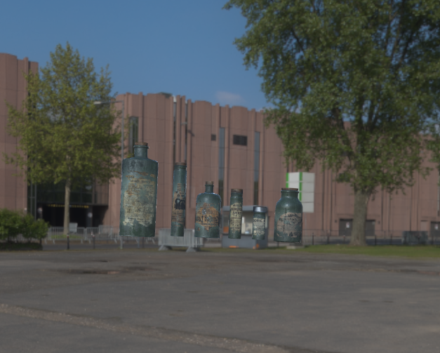

# IBL (Physically-Based Rendering - Image Based Lighting) ✨

 

PBR is a state-of-the-art rendering technique used in modern graphics applications and game engines. This repository contains a minimalistic implementation that showcases both diffuse lighting and image-based lighting techniques.

## 🌟 Features
- **Diffuse Lighting**: Achieve a realistic representation of light interaction with surfaces.
- **Specular Lighting & Split-sum Approximation**: Advanced techniques to capture intricate light reflections.
- **OpenGL Renderer**: Leverage the power of GPU to render complex scenes in real-time.
- **Modular Architecture**: Separate components for easy extension and experimentation.

## 📦 Prerequisites

- OpenGL
- GLFW3
- ASSIMP

## 🎨 Assets

- **Model Assets**: [Download here]([LINK_TO_MODEL_ASSETS](https://skfb.ly/oIOWN))
- **Environment HDR IBL Map**: [Download here]([LINK_TO_HDR_IBL_MAP](https://www.hdri-hub.com/hdrishop/freesamples/freehdri/item/113-hdr-111-parking-space-free)

> 🚀 Note: Make sure to place the downloaded assets in the appropriate directories before running the project.

## 🛠️ Building the Project

1. Clone this repository:
   ```git clone https://github.com/PixelSenseiAvi/LightingInPBR.git```
2. Navigate to the project directory:
   ```cd PBR```
3. Create a build directory and navigate to it:
   ```mkdir build && cd build```
4. Generate the project files:
   ```cmake ..```
5. Build the project:
   ```cmake --build . --config Release```

## 🚀 Usage

Once compiled, you can run the executable PBR from the build directory.
### 📚 Resources & References

For those keen on diving deep into the science and maths behind PBR, here are some invaluable resources:

    [Physically-Based Rendering: From Theory to Implementation](https://www.pbrt.org/)
    [Real-Time Rendering, Fourth Edition](https://www.realtimerendering.com)

## 🤝 Contributing

Contributions are welcome! Feel free get in touch.

## 📄 License

This project is licensed under the [MIT License](https://github.com/PixelSenseiAvi/LightingInPBR/blob/main/LICENSE). See the LICENSE file for details.
